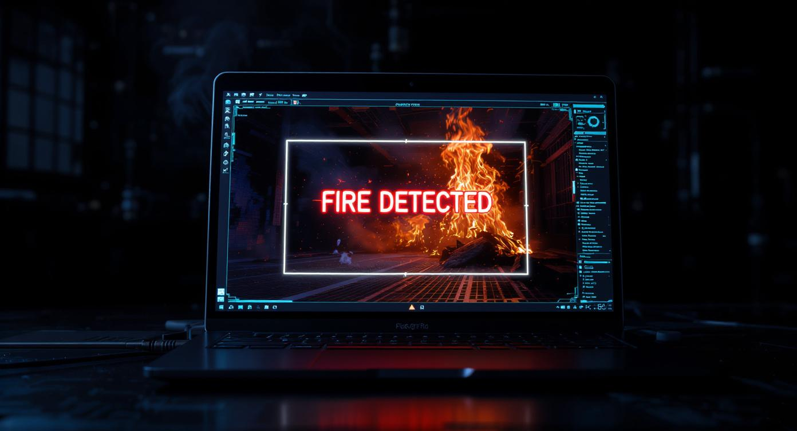
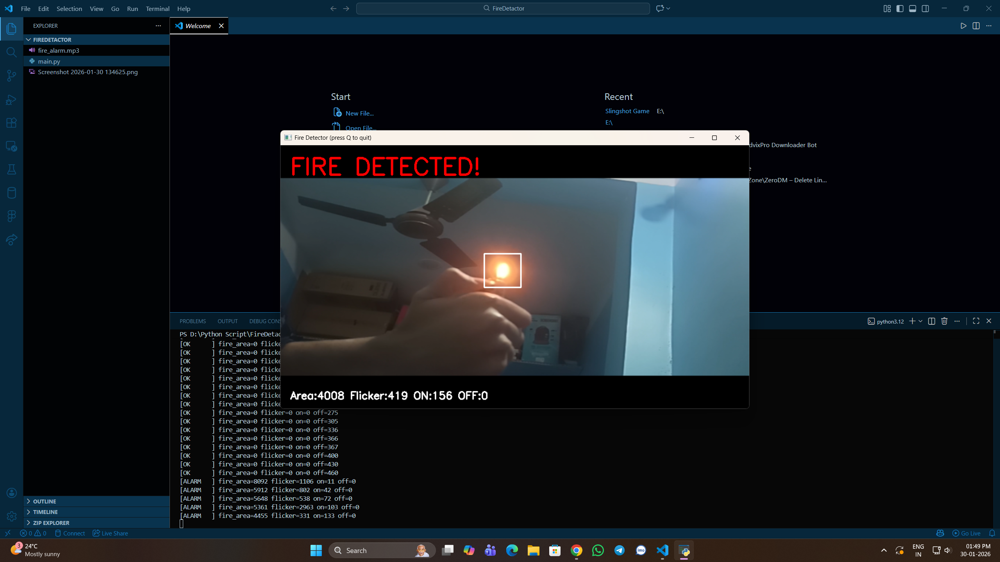

<p align="center">
  
</p>

<p align="center">
  <b>Real-time fire detection with alarm using computer vision.</b>
</p>

<h1 align="center">FlameWatch – Fire Detector</h1>

<p align="center">
  <b>OpenCV • Python • Real-Time Camera Monitoring</b><br>
  Version 1.0.0 • Developed by <a href="https://amitdas.site">Amit Das</a>
</p>

---

## 🧩 Overview

**FlameWatch – Fire Detector** is a real-time computer vision system that detects fire using your webcam and instantly triggers an alarm.

It uses **HSV color detection** and **flicker analysis** to identify real flames while avoiding false alerts from static objects like red clothes, lights, or reflections.

This project is ideal for:
- Home safety demos  
- Smart surveillance prototypes  
- Computer vision learning  

All processing happens **locally on your PC** — no internet required.

---

## ⚙️ Features

✅ Real-time fire detection via webcam  
✅ Smart flicker verification to reduce false alarms  
✅ Alarm sound on confirmed fire  
✅ Bounding boxes around fire regions  
✅ Live terminal analytics logs  
✅ Clean Tkinter start screen  

---

## 🖥️ How It Works

1. Webcam captures live frames  
2. Frames converted to **HSV color space**  
3. Orange/yellow fire colors are isolated  
4. **Flicker motion** is measured between frames  
5. Fire is confirmed after multiple frames  
6. Alarm is triggered and warning appears  

---

## 🛠️ Requirements

- Python 3.9+
- OpenCV
- NumPy
- Pygame
- Tkinter (comes with Python)

### Install dependencies
```bash
pip install opencv-python numpy pygame
````

---

## ▶️ Run the Project

```bash
python main.py
```

Click **START** to begin fire monitoring.
Press **Q** to stop and close the camera.

---

## 🖼️ Screenshots

### 🔥 Fire Detected

<p align="center"></p>

### 🎥 Live Camera View

<p align="center">
  <a href="https://www.youtube.com/watch?v=P-w17AdjpsQ" target="_blank">
    
  </a>
</p>

---

## 🔒 Safety Disclaimer

This project is for **educational and demonstration purposes only**.
It should not replace certified fire detection or safety equipment.

---

## 📜 License

MIT License
© 2026 **Amit Das**

---

<p align="center">
  <b>Made with ❤️ by <a href="https://amitdas.site">Amit Das</a></b><br>
  ☕ Support development: <a href="https://paypal.me/AmitDas4321">PayPal.me/AmitDas4321</a>
</p>
